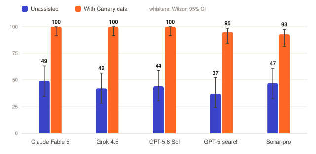
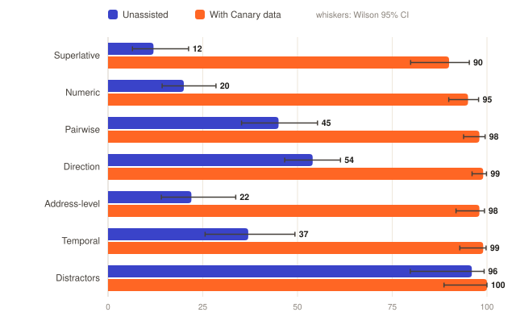

# Do AI assistants know how neighborhoods are changing?
### An area-level ground-truth benchmark with a grounding ablation. Working note v1 (pilot), San Francisco.

**Melany Macías · Katerina Tchilinguirov**
*Canary · July 26, 2026*

---

## Abstract

Large language models are increasingly consulted for residential decisions. We
evaluate five frontier models (Claude Fable 5, GPT-5.6 Sol, GPT-5 with native web
search, Perplexity sonar-pro, Grok 4.5) on 43 verifiable questions about San
Francisco neighborhoods, covering direction of change, cross-neighborhood rankings,
counts, pairwise comparisons, and approved construction near specific addresses.
Ground truth for every question is computed from municipal public records and
carries a citation; the question set was frozen at a git commit prior to any model
query. In the unassisted condition, accuracy ranges from 37% to 49%. In contrast to
the previous model generation, refusals are rare; the dominant failure mode is
confident error, with individual models producing confidently wrong answers on up to
25 of 43 items. Twenty-four of 25 answers to ranking questions ("which neighborhood
changed most") were incorrect, as were 39 of 40 counting answers graded against a
±30% tolerance. When a single Canary API response is prepended to the same
questions, accuracy rises to 93-100%, with three of five models answering all 43
items correctly. Control blocks indicate the deficit is specific to aggregate,
present-state facts: the same models score 95% on equivalent questions inside their
training window and nine of ten distractor responses resist the planted artifacts.
Validity is checked from three directions: every expected answer was re-derived
from the city's own APIs by a script independent of our pipeline (42 of 43
confirmed; the exception is disclosed as an erratum), verdicts were replicated by a
cross-vendor judge panel (Fleiss kappa 0.95, no measurable self-preference), and
all results carry Wilson 95% intervals with exact McNemar tests (p < 4 × 10⁻⁵ for
every model). We interpret these results as evidence that the failure is one of
data availability rather than model capability or retrieval freshness: the target
facts had not previously been computed or published, and therefore cannot be
recalled or retrieved at any capability level.

## Lay summary

We asked the five newest AI models 43 checkable questions about San Francisco
neighborhoods, the kind anyone deciding where to live actually asks: is crime
getting better here, where are new businesses opening, how much housing was just
approved near this address. Every question has a verifiable answer in the city's
public records. On their own, the models scored between 37% and 49%, and unlike
older models they rarely said "I don't know"; one gave confidently wrong answers on
25 of 43 questions. Asked which neighborhood was rising fastest, the five models produced
four different confident answers, all wrong. The reason is that these answers were
never written down anywhere: nobody had computed them from the millions of raw
records the city publishes, so there was nothing for a model to learn or retrieve.
When we supplied the same models with one response from Canary's data, three scored
perfectly and the other two came close. The models were not the limiting factor. The
missing data layer was.

We also checked our own homework. An independent program, sharing no code with our
system, re-derived every answer straight from the city's records and confirmed 42
of the 43. The one it flagged was a bug on our side, in the geometry of one
question, and the paper describes it openly; correcting it would make the models
look slightly better, not worse. A second opinion on the grading, from judges built
by three different companies, agreed with the original verdicts 97% of the time.

## 1. Introduction

Prior evaluations of language models on local information concern the *place* level.
VOYGR's Quarterly LLM Benchmarking Study (345 prompts on venues, hours, and
bookings) documents recommendations of closed and fabricated establishments. The
Silicon Gaze audit of twenty million queries finds that model-produced neighborhood
rankings track social divides rather than measured characteristics. To our
knowledge, no benchmark has addressed the *area* level: the direction in which a
neighborhood is changing, and what has been approved for construction there. We note
that VOYGR's 345 local prompts contain no area-change questions; the category is
unmeasured, consistent with it being unserved by existing data products.

An earlier pilot of ours (v0: 46 questions, previous-generation models) measured
unassisted accuracies of 0-39%, dominated by refusals. A natural objection is that
frontier progress will close this gap without any change to the data models can
access. The present study tests that objection. It does not hold: capability
improved, refusals largely disappeared, and accuracy on the diagnostic blocks did
not improve. The failure mode shifted from abstention to confident error.

The study also includes an ablation designed to locate the bottleneck. Each model
answers every question twice: once unassisted, and once with a single simulated API
response from our system prepended to the prompt. If the deficit were one of
reasoning, added context should help only marginally. If the deficit is one of data
availability, grounded accuracy should approach the ceiling. The results support the
second interpretation.

This note makes five contributions: (1) to our knowledge the first area-level
benchmark of AI assistants on neighborhood change, with a receipt behind every
expected answer and the question set frozen at a git commit before any model
query; (2) a grounding ablation across five frontier models from four vendors;
(3) an independent verification methodology, in which a script sharing no code
with our pipeline re-derives every expected answer from the city's own APIs,
together with the erratum that verification produced; (4) a cross-vendor judging
protocol with a measured self-preference test; and (5) a complete public artifact
set spanning questions, receipts, raw answers, verdicts, statistics, and
verification outputs.

## 2. Methods

This section describes the ground truth against which all answers are graded
(§2.1), the construction and freezing of the question set (§2.2), the two
experimental conditions (§2.3), the judging protocol (§2.4), and an independent
verification of the ground truth against the city's own APIs, including one
erratum it produced (§2.5).

### 2.1 Ground truth

Expected answers are computed by the Canary pipeline from municipal public records:
building permits, the business registry, police incident reports, eviction notices,
and 311 service requests, using DataSF snapshots whose as-of date is recorded on
every row. Events are indexed on an H3 hexagonal spine and aggregated to the city's
analysis neighborhoods.

Three properties of the ground truth bear on benchmark validity.

1. **Provenance.** Every row carries the source's own publication date and our fetch
   date, making every expected answer reproducible against a stated snapshot.
2. **Receipts.** Every expected answer traces to identifiable records (permit
   numbers, registry entries) rather than to composite scores.
3. **Measurement corrections.** Public records mislead in documented ways, and the
   ground truth incorporates corrections established before any model was tested.
   Police incident counts conflate victim-initiated reports with proactive
   enforcement activity; we separate the two, since an enforcement surge is not a
   crime wave. A March 2026 change in the city's 311 application inflated nominal
   noise complaints by 62%; the artifact was detected via channel and category
   decomposition and excluded from the claimable metric. Business closure dates lag
   reality, and the lag is documented. The validation of the trajectory signal
   itself, including one case in which the receipts corrected our own mistaken
   narrative attribution, is reported in Appendix A.

### 2.2 Benchmark design

The instrument contains 43 questions in seven blocks, generated programmatically
from the database and frozen at git commit `064dc90` before any model was queried.
The initial target of 50 was reduced by quality floors: two candidate addresses had
insufficient nearby construction to support an unambiguous question, and two
candidate pairwise comparisons had effect-size gaps too narrow to grade fairly.

| Block | n | Form | Rationale |
|---|---|---|---|
| Direction | 15 | "Is X rising or falling in {neighborhood}?" | Press coverage sometimes exists; recall can succeed |
| Superlative | 5 | "Which neighborhood had the largest increase in X?" | Requires an aggregation over all areas that has not been published |
| Numeric | 8 | Counts, ±30% tolerance | Tests quantitative knowledge directly |
| Pairwise | 6 | "Which of A or B rose more?" | Chance baseline is 50%; measures comparison under uncertainty |
| Address-level | 3 | "Units approved within ~500 m of {address}?" | The forward-looking question relevant to an individual property |
| Temporal | 4 | Changes between the years ending June 2024 and June 2025 | Control: falls inside training windows |
| Distractors | 2 | Enforcement-vs-victimization; the 311 artifact | Control: penalizes uncritical acceptance of misleading aggregates |

Metrics used include victim-reported crime, business openings, eviction filings,
encampment reports, and net approved housing units. Volume and effect-size floors
ensure that each expected answer is unambiguous at the stated tolerance.

One bookkeeping note for reproducers: the second distractor (the
enforcement-versus-victimization item, q042) is typed `direction` in the frozen
artifact file. All analyses classify it with the distractor block, as tabled above,
and the analysis script (`app.benchmark.stats`) encodes that mapping explicitly.

### 2.3 Experimental setup

Two conditions with identical questions. In the **unassisted** condition, the model
receives the question and a system prompt instructing it to commit to a direct
answer. In the **grounded** condition, the prompt is prefixed with one simulated
Canary API response: the data slice a single call would return, together with field
documentation, since metric definitions accompany every genuine API response. For
address-level items the payload contains the ring aggregate and the largest
constituent permits, matching the `/api/report` endpoint.

Protocol correction (v1.0.1): the initial address-level payload omitted the ring
aggregate and contained only the ten largest permits. Models summed the partial list
they were given and were scored incorrect. This was a payload construction error on
our side, not a model failure; the payload was corrected, the condition re-run, and
the incident is disclosed here.

Provider-default temperature was used throughout, on the grounds that it reflects
deployed consumer behavior, and because several current APIs reject non-default
temperature settings. One run per condition (this is a pilot; stability replicates
are planned for v1.1). Total API cost was approximately $25. Exact model
identifiers: `claude-fable-5`, `gpt-5.6-sol`, `gpt-5-search-api`, `sonar-pro`,
`grok-4.5`. Gemini could not be included due to account constraints and is planned
for v1.1.

### 2.4 Judging

Answers are graded by an LLM judge (`claude-sonnet-5`, held out of the test set)
that receives the question, the pre-verified ground truth with its receipt, and the
model's answer, and classifies only whether the answer commits to the recorded
truth: *correct*, *wrong*, or *nonanswer* (refusals and non-committal hedges). Wrong
answers delivered without meaningful hedging are additionally flagged as
*confidently wrong*; following VOYGR's scoring rationale, we regard this as the most
costly outcome for users, who receive misinformation rather than no information.

**Judging completeness.** The initial judging pass left 19 of 430 verdicts
unparsed, in most cases because the judge's token cap truncated long verdicts
mid-JSON. The holes were filled in a repair pass that grades only missing verdicts,
with the same judge and the same prompt; existing verdicts are never re-graded, and
every repaired verdict is flagged in the artifacts. One verdict (GPT-5 search,
grounded, q032) failed repeatedly and is excluded rather than assumed. During
review we identified one verdict that deviates from the rubric (a direction item
graded on stated magnitude rather than direction); it is retained as judged, since
verdicts are never edited by the authors after the fact, and it is flagged for the
human audit.

**Cross-vendor panel.** Every answer was additionally re-graded by two judges
from other vendors (`gpt-5.6-sol` and `grok-4.5`, each itself a tested system,
which we disclose), using the identical prompt as the primary judge. Across the
427 of 430 items where all three verdicts parsed, pairwise agreement is 97.2 to
97.9%, Fleiss kappa is 0.95, and 96.5% of items are unanimous, with no item
lacking a majority. Recomputing accuracy under majority verdicts moves no cell
of Table 1 by more than seven percentage points and changes no conclusion. A
direct self-preference probe (does a judge rate its own vendor's answers correct
more often than the other two judges rate the same answers?) finds none: the
deltas are −1.2, −0.6, and 0.0 percentage points for the Anthropic, OpenAI, and
xAI judges respectively, the first two mildly against self. The primary
estimator remains the pre-specified single judge; the panel is reported as a
robustness check (`benchmark_v1_panel.json`, verdicts under
`benchmark_runs_v1/panel/`).

All verdicts are stored with one-line rationales
(`benchmark_runs_v1/*.judged.json`) and are auditable. A stratified human audit of
judge verdicts is part of the protocol, with the agreement rate to be published as
the judge's error bar. One limitation is noted for the record: the judge shares a
vendor with one tested model. The fixed-evidence design (the judge never assesses
facts, only commitment to supplied facts), the cross-vendor panel below, and the
human audit are the mitigations.

### 2.5 Independent verification and an erratum

A benchmark whose ground truth is computed by the authors' own pipeline invites a
circularity objection. To remove it, every expected answer was re-derived by a
standalone script (`scripts/verify_v1_answers.py`) that uses only the Python
standard library and HTTP: it queries the city's own SODA endpoints directly,
aggregates server-side, and uses the city's own analysis-neighborhood
assignments rather than our H3 spine. The script shares no code with the Canary
pipeline, and its raw API responses are archived alongside the report.

Forty-two of 43 expected answers were confirmed. All five superlative winners
and all six pairwise winners reproduce across roughly forty neighborhoods under
the same volume floors; the Tenderloin decomposition reproduces exactly
(victim-reported crime down 8.0%, enforcement activity up 43.6%); and the 311
artifact reproduces exactly (+61.9% nominal, +25.9% with the catch-all category
excluded, the catch-all alone carrying 56.6% of the nominal volume). Drift
between the frozen 2026-07-24 snapshot and the live API at verification time was
negligible: 3 of 20 count-window comparisons moved, by at most 5.3%, one of them
because an eviction notice was removed from the record, a useful reminder that
these datasets are append-mostly rather than append-only.

The one mismatch is an erratum against ourselves. The address-level ring
geometry was computed with a swapped coordinate axis order: the distance
function follows the EPSG:4326 authority order (latitude first), so the "500 m"
rings were in fact ellipses of roughly 395 m east-west by 933 m north-south.
Under corrected geometry the expected values of two of the three address
questions stand within their tolerances; the third (q037) does not. The true
500 m disk around that address contains 188 net units against the frozen
expected 53, the gap dominated by a single 185-unit permit 459 m away.
Following the pre-registered freeze, no verdict is re-graded: the frozen values
remain the graded truth. We note the sensitivity openly: under the corrected
value, two unassisted answers (Grok 4.5's "100 to 200" and Claude Fable 5's
"200 to 400") would plausibly grade correct, raising pooled address-level
unassisted accuracy from 13% to at most 27%. The error therefore harmed the
models, not our thesis, and no conclusion changes. The grounded condition is
unaffected in kind, since it grades whether models commit to the supplied
payload, which carried the same ring value. The geometry is fixed in the
generator and in the production lookup path, q037 regenerates correctly in
v1.1, and this note is the erratum of record.

## 3. Results

Table 1 and Figure 1 report overall accuracy by model; Table 2 and Figure 2
report accuracy by question block, pooled across the five models. Uncertainty is
reported as Wilson 95% intervals (in brackets), and the condition contrast is
tested per model with an exact McNemar test on question-paired outcomes. Every
number in this section is emitted by `app.benchmark.stats` from the stored
verdicts; the tables are pasted from its output.

Table 1. Overall accuracy by model and condition, with Wilson 95% intervals and
exact McNemar p for the paired condition contrast.

| Model | Unassisted | Grounded | Confidently wrong (unassisted) | McNemar p |
|---|---|---|---|---|
| Claude Fable 5 | 49% [35, 63] | **100%** [92, 100] (43/43) | 19/43 | 4.8 × 10⁻⁷ |
| Grok 4.5 | 42% [28, 57] | **100%** [92, 100] (43/43) | 25/43 | 6.0 × 10⁻⁸ |
| GPT-5.6 Sol | 44% [30, 59] | **100%** [92, 100] (43/43) | 23/43 | 1.2 × 10⁻⁷ |
| GPT-5 search | 37% [24, 52] (13 refusals) | **95%** [84, 99] (40/42)¹ | 11/43 | 6.0 × 10⁻⁸ |
| Perplexity sonar-pro | 47% [33, 61] | **93%** [81, 98] (40/43) | 21/43 | 3.6 × 10⁻⁵ |

¹ One grounded verdict (q032) failed to parse across repeated judging attempts and
is excluded rather than assumed; the 95% reflects the 42 judged answers.



**Figure 1.** Overall accuracy by model and condition (data of Table 1). "With
Canary data" is the grounded condition: the model sees one Canary API response
before answering. Every model roughly doubles its accuracy. Whiskers are Wilson
95% intervals; the GPT-5 search grounded bar reflects the 42 judged verdicts.

Table 2. Accuracy by question block, pooled across the five models, with Wilson
95% intervals and exact counts.

| Block | Unassisted | Grounded |
|---|---|---|
| Superlative | 4% [1, 20] (1/25) | 92% [75, 98] (23/25) |
| Numeric | 2% [0, 13] (1/40) | 100% [91, 100] (40/40) |
| Pairwise (chance = 50%) | 67% [49, 81] (20/30) | 93% [78, 98] (27/29) |
| Direction | 56% [45, 67] (42/75) | 100% [95, 100] (75/75) |
| Address-level | 13% [4, 38] (2/15) | 93% [70, 99] (14/15) |
| Temporal (in training window) | 95% [76, 99] (19/20) | 100% [84, 100] (20/20) |
| Distractors | 90% [60, 98] (9/10) | 100% [72, 100] (10/10) |



**Figure 2.** Accuracy by question block, pooled across the five models (data of
Table 2), with Wilson 95% whiskers. The blocks that require an unpublished
aggregation (superlative, numeric, address-level) collapse in the unassisted
condition and recover when grounded; the temporal control, whose answers fall
inside training windows, is near ceiling in both conditions. The temporal and
distractor blocks are small and their intervals correspondingly wide.

### 3.1 Error analysis: the superlative block

Question 16 asked which San Francisco neighborhood had the largest increase in new
business openings over the past year. The registry answer is Japantown (+38%, the
largest rise citywide). Representative unassisted responses:

- **Grok 4.5:** "Mission District," supported by reasoning about pre-2025 permitting
  trends and foot traffic along the Valencia corridor.
- **GPT-5.6 Sol:** Union Square, attributed to the downtown retail rebound.
- **Claude Fable 5:** Downtown/Union Square, citing the city's Vacant to Vibrant
  program and first-year tax waivers as mechanisms.
- **Perplexity sonar-pro:** Mission Bay, citing a genuine 2025 sales-tax analysis
  retrieved from the web.

Four distinct answers, each argued from real but non-dispositive context, none
correct. Across the block, the single correct response of 25 was the
search-configured model identifying Bernal Heights as the largest drop in
victim-reported crime; every "which is rising" item was missed by every model. We note a qualitative difference from v0, where three previous-generation
models converged on the same incorrect answer (the Mission), a pattern consistent
with shared training-distribution priors. The frontier models diverge more, and
construct more sophisticated justifications, without any improvement in accuracy.
This is the expected signature of a task whose answer is absent from the training
distribution and from the retrievable web: no reasoning path terminates at the fact,
because the fact was never published. In the grounded condition, Grok 4.5 answered
the same question in one line: Japantown, 50 to 69 openings, +38%, with the
z-score.

### 3.2 Error analysis: the numeric block

Asked how many net new housing units were approved in Nob Hill in the twelve months
before July 2026, GPT-5.6 Sol answered "roughly 25 net new housing units," with a
caveat about boundary definitions. The permit record gives 1,319, driven by a small
number of large approved projects. The error is a factor of approximately fifty, and
the response format (a specific figure with a methodological caveat) is
indistinguishable from that of an informed estimate. Thirty-nine of the 40
unassisted numeric answers fell outside the ±30% tolerance; the single pass was
Claude Fable 5 on the South of Market unit count, answering with a range whose
upper portion overlaps the tolerance band. When grounded, all five models answered
all eight numeric items correctly.

### 3.3 The generational shift in failure mode

In v0, previous-generation models refused frequently (GPT-4o declined 39 of 46
items). In v1, refusals nearly disappear outside the search-configured model, and
error mass moves into confident, specific, well-argued wrong answers (19-25 of 43
per model; 11 for the search-configured model, which still refuses). From a user-welfare perspective this is a regression: an abstention
prompts further search, whereas a fluent wrong answer terminates it.

### 3.4 Controls

The temporal block, whose answers fall inside the models' training windows, scored
95% unassisted. Nine of the ten distractor responses were correct; the single miss
is the designed failure occurring in the wild: Grok 4.5 affirmed that Tenderloin
crime had worsened, accepting the enforcement-driven aggregate the item plants.
Models are otherwise well calibrated on the recorded past and are largely not
deceived by the statistical artifacts. The deficit is confined to aggregate facts about
the recent present, which is precisely the class of fact that must be computed from
primary records rather than remembered from text.

### 3.5 Grounded condition

With one API response prepended, three of five models answered all 43 items
correctly, and the remaining two scored 93% and 95%, with residual misses
attributable largely to judge strictness on phrasing rather than misreading. Five
models from four vendors used the same documented payload without any per-model
tuning. We take this as evidence that current frontier models are already sufficient
consumers of structured area data, and that the binding constraint is the existence
and machine-legibility of the data itself.

## 4. Discussion

**The deficit is informational, not cognitive.** Three observations triangulate this
conclusion: capability improved between generations while diagnostic-block accuracy
did not; search-native configurations failed alongside parametric ones; and supplying
the missing data recovered near-ceiling performance in every model tested.
Aggregations that have never been published cannot be retrieved, and additional model
scale does not conjure them.

**Fluency without grounding harms users.** The shift from refusal to confident error
means the cost of the missing data layer is rising with model quality. The
qualitative examples in §3.1 and §3.2 illustrate answers whose surface form carries
the markers of expertise while the content is wrong by wide margins.

**Machine-readable semantics are part of the data.** Our own v1.0.1 payload error is
instructive: models faithfully aggregated an incompletely specified payload. Field
documentation accompanying data is not a convenience; it determines whether grounded
answers are correct.

**Corrections are part of the data.** The ground truth required documented
adjustments (enforcement versus victimization, the 311 reporting artifact, closure
lag) before it could fairly grade anyone. Systems that ingest raw public records
without such corrections inherit exactly the errors this benchmark penalizes. The
same discipline applies to ourselves: the independent verification of §2.5 caught a
geometry bug in our own generator that internal review had not, and we regard
external re-derivation as a standing requirement of benchmark practice rather than
a one-time exercise.

**Scope of claims.** These results establish the failure and its remediability at
pilot scale, on our question dimensions, in one metropolitan area. They do not
establish market demand for external grounding; that is an adoption question outside
the scope of this study.

## 5. Limitations

One metro; one run per condition; 43 questions; five models, with Gemini absent.
Nineteen of 430 primary verdicts were completed in a disclosed repair pass after
truncation failures, and one grounded verdict remains unparsed and excluded. The
address-level block carries the ring-geometry erratum of §2.5, whose corrected
values would raise, not lower, the models' unassisted scores. The
judge is a language model: verdicts are stored and auditable, a human audit of a
verdict sample is owed, and the judge shares a vendor with one tested model,
though the cross-vendor panel (§2.4) measures that risk directly and finds
kappa 0.95 agreement with no self-preference. In the
grounded condition, Canary data serves as both context and ground truth by design;
the condition tests whether models retrieve and commit to supplied area data, while
the validity of the data itself is assessed separately, with receipts and
falsifiable forward predictions, in Appendix A. The ±30% numeric
tolerance is permissive. The temporal (n=4) and distractor (n=2) blocks are small
and their percentages carry wide uncertainty.

## 6. Reproducibility

```
cd backend
python -m app.benchmark.generate_v1        # regenerate questions from the live snapshot
python -m app.benchmark.run                # unassisted condition, all configured providers
python -m app.benchmark.run --grounded     # grounded condition
python -m app.benchmark.judge              # primary verdicts and summary table
python -m app.benchmark.judge --repair     # complete any unparsed verdicts (flagged)
python -m app.benchmark.panel              # cross-vendor judge panel
python -m app.benchmark.panel --agree      # panel agreement report
python -m app.benchmark.stats              # Wilson intervals, McNemar, Tables 1-2
python scripts/gen_figures.py              # Figures 1-2 from the stats artifact
python scripts/verify_v1_answers.py        # Canary-free re-derivation from city APIs
```

Artifacts: `data/processed/benchmark_v1.json` (questions and receipts, frozen at
`064dc90`); `data/processed/benchmark_runs_v1/` (all raw answers and judged
verdicts), stamped with pipeline git version and source snapshot date. The intended
cadence is monthly regeneration alongside the data, so that the question set tracks
the live record.

## 7. Future work

Version 2 is specified in a draft pre-registration (`PROTOCOL_V2.md` in the
repository), to be frozen and registered on OSF before any v2 model query. It
scales the design to 240 questions across two metros (San Francisco and Chicago),
roughly eight systems including an open-weights model, and three replicates per
condition. Grading moves to the cross-vendor panel with a published human audit;
whether an answer is retrievable on the public web becomes a measured stratum,
via a scripted search audit archived at freeze time; ground-truth verification
runs at freeze rather than post hoc; and a compensated human baseline, closed
book and then with internet access, is added in each metro. Beyond v2, the
intended cadence is a recurring, versioned report regenerated alongside the data,
so that the question set tracks the live record and results remain accountable
over time. Gemini joins when account constraints permit.

## Appendix A: Validation of the trajectory ground truth

Before the benchmark could grade anyone, the signal that generates its expected
answers had to be validated. We selected seven San Francisco neighborhoods with
well-documented arcs over 2020-2026 and compared the pipeline's per-dimension
trajectory (trailing twelve months against the twelve before, standardized citywide)
against both the underlying records and the documented narrative. Every claim below
has two layers: the computed signal, and the receipt, meaning identifiable records
such as permit numbers and registry entries. Where an external narrative is cited it
was widely reported at the time and is labeled as context, distinct from the record.

| Neighborhood | Dimension | Computed | Receipt (our data) | Verdict |
|---|---|---|---|---|
| Treasure Island | permits issued | +38%, z+1.0 | $79.4M six-story 150-unit residential (issued 2026-07-01); $40M fully affordable 100-unit building; $31M new construction; 20,000 yd³ grading. Matches the documented island redevelopment. | Confirmed |
| Lakeshore | permits issued | +156%, z+4.9 | Top permits are a $6.5M golf maintenance building, a $5M gatehouse, and a parking expansion; zero housing units. Our initial attribution to the Stonestown redevelopment was wrong; those permits are not yet in the issued record. | Corrected |
| Tenderloin | crime incidents | +11%, z+2.5, against a citywide decline of 8% | Decomposition: drug offenses 1,790 to 2,824 (+58%), warrants +35%, assault flat (1,109 to 1,134). An enforcement surge, not a victimization surge. | Consistent, reframed |
| Mission | business openings | −19%, z−1.3 | Named closures on record across retail, salons, and labs; matches the documented Valencia Street churn. | Consistent |
| Financial District / South Beach | net business churn | +235 net, the city's highest | 1,666 openings against 1,431 closings; matches the downtown recovery narrative. | Consistent |
| Bayview Hunters Point | permits; business churn | permits −21.6%; net churn −18, the city's lowest | Aggregate counts; consistent with documented underinvestment. | Consistent |
| Japantown | business openings | +38%, z+2.9 | Openings are predominantly health practices, physicians, and restaurants. No documented narrative exists. | Lead (model-surfaced) |

Two failures in this pass were more informative than the successes, and both are now
design features. First, the Lakeshore correction: the magnitude signal was real, but
the narrative we first attached to it was wrong, and the underlying permits showed
it (golf course capital works, zero housing units). The per-dimension design
contained the tell, since net approved units sat near zero; a single composite score
would have obscured the error. Second, the Tenderloin decomposition: police incident
data measures proactive enforcement in some categories and victim reports in others,
and splitting them inverts the headline (victim-reported crime fell 8.0% while
enforcement activity rose 43.6%; citywide, −18.7% against +29.7%). Both corrections
were subsequently encoded as benchmark items (§2.2, distractors).

A related correction was made after this pass: loading the full 311 archive (8.79M
cases since 2008) revealed that the nominal noise-complaint trend (+61.9%) is
dominated by a March 2026 change in the city's reporting application, concentrated
in one catch-all category (+145%) and the mobile channel (+139% against +15% by
phone). The refined metric excluding the artifact rose 25.9%. The recurring lesson,
now standing policy, is that report-based metrics measure reporting as well as
reality, and each one requires a propensity check before a trend is published.

Falsifiable forward predictions, recorded July 2026 and checkable around January
2027: (1) Treasure Island remains top-three citywide in net approved housing units;
(2) Stonestown-driven residential permits appear in Lakeshore's issued record within
twelve months; (3) if the Tenderloin enforcement operation winds down, drug offense
counts fall toward baseline while assault remains flat, distinguishing an
enforcement pulse from underlying change.

## How to cite

```bibtex
@techreport{canary2026areabenchmark,
  title       = {Do AI assistants know how neighborhoods are changing?
                 An area-level ground-truth benchmark with a grounding ablation},
  author      = {Mac{\'i}as, Melany and Tchilinguirov, Katerina},
  institution = {Canary},
  year        = {2026},
  month       = {July},
  note        = {Working note v1 (pilot), San Francisco. Question set frozen at 064dc90.}
}
```
